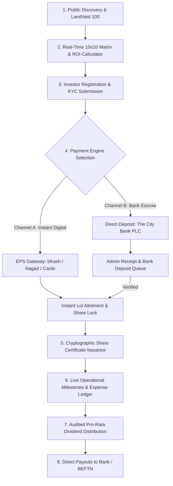

# 🌟 Swapnojatri Investment Platform (স্বপ্নযাত্রী ইনভেস্টমেন্ট প্ল্যাটফর্ম)
### 🇧🇩 Transparent, Asset-Backed Land & Agro Crowdfunding Platform

[](https://nextjs.org/)
[](https://flutter.dev/)
[](https://www.typescriptlang.org/)
[](https://tailwindcss.com/)
[](https://www.thecitybank.com/)
[]()

---

## 📌 Executive Summary

**Swapnojatri** (স্বপ্নযাত্রী) is a fintech platform built to democratize high-value prime land, smart agro-farming, and commercial property investments across Bangladesh. By breaking large land parcels into fixed, asset-backed units, retail and institutional investors can co-own verified land assets and participate directly in project appreciation and dividend yields.

The platform provides a **unified dual-interface architecture**:
1. **Production Next.js Web Platform**: Serves the public portal, investor dashboard, executive admin console, and native REST API backend ready for **single-server cPanel Node.js deployment**.
2. **Flutter Multiplatform Application**: Native iOS, Android, macOS, Windows, and Web client sharing unified business logic with offline-first caching and real-time backend synchronization.

---

## 🏢 Corporate Head Office & Escrow Custody

| Attribute | Official Verified Information |
| :--- | :--- |
| **Headquarters** | **Level 7, Concord Tower, Road 11, Gulshan-1, Dhaka-1212, Bangladesh** |
| **Site Desk** | Washpur Tower Road (Near Bosila Bridge), Savar, Dhaka |
| **Escrow Trustee** | **The City Bank PLC** (Gulshan-1 Branch, Dhaka) |
| **Escrow Account** | `1402-9988-7710-1` (Beneficiary: *Swapnojatri Investment Platform Ltd*) |
| **Bank Routing No**| `225275357` |
| **Trade Reg** | `TRAD/DNCC/049182/2026` |
| **Corporate TIN** | `718294019283` |
| **Helpline** | `+880 1712-345678` / `+880 1819-998877` |
| **Investor Support**| `invest@swapnojatri.com` |

---

## 🔄 Complete End-to-End Investment Lifecycle



### Detailed Flow Breakdown:

#### 1. 🔍 Project Discovery & Legal Transparency
- Investors explore active projects (e.g., **LandVest 100**, Savar Mouza Plot 418, 22.5 Decimals).
- Direct access to the **Cryptographic Document Vault**: Sub-Registry Title Deed `#4982/2026`, Legal Vetting Report, AC Land Mutation Khatian, and Government Valuation records with SHA-256 hashes.
- Interactive **10x10 Lot Matrix** displays allocated shares, investor-owned shares, and real-time available units.

#### 2. 🧮 Interactive Investment Calculator
- Dual-mode calculator (dynamic stepped pills + slider) recalculates total capital commitment, estimated ROI timeline, and equity percentage in real time.
- Individual investor ceiling: 1 to 4 shares (prevents monopolization).

#### 3. 👤 Seamless Authentication & Investor KYC
- Bilingual sign-in / registration (English & Bengali).
- KYC profile verification collecting:
  - Full legal name (as per NID/Passport).
  - NID / Smart Card / Passport number & photo verification.
  - Emergency contact and designated legal nominee declarations.
  - Payout bank account details (Bank Name, Branch, Account No, Routing No).

#### 4. 💳 Dual Payment Engine & Verification
- **Channel A — Instant Digital Payment (EPS Gateway)**:
  - Instant online checkout supporting **bKash, Nagad, Rocket, Visa/Mastercard, and Internet Banking**.
  - Automated immediate lot locking, receipt issuance, and certificate generation.
- **Channel B — Bank Escrow Deposit**:
  - Direct wire transfer, BEFTN, NPSB, RTGS, or Pay-Order to **The City Bank PLC Escrow Account**.
  - Investor uploads the deposit slip image and enters transaction reference.
  - Routed to the **Admin Verification Queue** for physical reconciliation before allotment.

#### 5. 📜 Cryptographic Share Certificate Issuance
- Upon confirmation, the system assigns unique sequential Lot IDs (e.g., `#LV100-042`).
- Issues a digital **Share Ownership Certificate** containing:
  - Investor name & NID.
  - Project identity & mouza plot number.
  - Cryptographic verification hash (SHA-256).
  - Corporate seal & authorized director digital signatures.

#### 6. 📊 Real-Time Fund Transparency & Expense Ledger
- **Live Fund Tracker**: Target Fund (৳25.5L) vs. Collected Capital vs. Utilized Capital vs. Escrow Balance.
- **Expense Voucher Book**: Itemized expenses (Land registration, boundary fencing, soil filling, legal vetting) backed by scanned vouchers and auditor badges.

#### 7. 💰 Pro-Rata Profit Distribution
- Mathematical dividend distribution formula:
  $$\text{Investor Payout} = \frac{\text{Distributable Net Profit} \times \text{Eligible Shares}}{100}$$
- Status lifecycle: `Draft` $\rightarrow$ `Approved` $\rightarrow$ `Processing` $\rightarrow$ `Paid`.
- Direct credit to the investor's designated bank account via BEFTN / MFS with instant SMS/Email notifications.

#### 8. 🛡️ Executive Admin Management & Governance
- **Executive KPI Dashboard**: Total capital raised, active projects, escrow utilization, and distribution schedules.
- **Deposit Slip Inspector**: Full-resolution receipt viewer with 1-click *Approve & Allocate* or *Reject with Reason*.
- **Project & Milestone Manager**: Publish new land/agro projects, milestones, photo updates, and drone inspection videos.
- **Immutable Audit Trail**: Append-only log tracking every action, actor ID, IP address, and timestamp.

---

## 🗺️ Interactive Office Map (Contact Page)

The Contact page features a compact Google Maps widget styled after official Google Maps cards:
- **Location**: Concord Tower, Road 11, Gulshan-1, Dhaka-1212.
- **Coordinates**: `23.7788° N, 90.4158° E`.
- **Interactive Actions**:
  - 🔗 **Open in Google Maps**: Direct link to coordinates in Google Maps.
  - 🔷 **Turn-by-turn Directions**: 1-click driving, transit, and walking route planner.
  - **Live Indicator**: Active Desk hours (`Sun - Thu: 10:00 AM - 6:00 PM`).

---

## 🛠️ Technology Architecture

### 1. Web Platform (`website/`)
- **Framework**: Next.js 14.2.15 (App Router, Server & Client Components)
- **Styling**: Tailwind CSS, PostCSS, Custom Design Tokens
- **Icons**: Lucide React
- **Typography**: Google Fonts (`Outfit`, `Hind Siliguri`, `Inter`)
- **Serverless API Engine**: Integrated Route Handlers under `/api/*`
- **cPanel Deployment**: Passenger `server.js` and `.htaccess` rewrite engine

### 2. Flutter Mobile & Desktop Client (`lib/`)
- **Framework**: Flutter 3.22+ / Dart 3.4+
- **Architecture**: Service-Repository Pattern with reactive `AppState` (`ChangeNotifier`)
- **Charts**: `fl_chart: ^0.69.0`
- **Animations**: `flutter_animate: ^4.5.0`
- **Localization**: Bilingual (Bengali & English) with South Asian comma formatters (`৳ ২৫,৫০,০০০`)
- **Networking**: `http: ^1.2.2` with offline cache fallback

---

## 🌐 Complete REST API Reference

The Next.js backend provides a full REST API accessible at `/api/*`:

| Endpoint | Method | Description | Auth Required |
| :--- | :---: | :--- | :---: |
| `/api/health` | `GET` | System health check & timestamp | No |
| `/api/projects` | `GET` | List all investment projects | No |
| `/api/projects` | `POST` | Create a new investment project | Admin |
| `/api/projects/[id]` | `GET` | Get single project details & ledger | No |
| `/api/projects/[id]` | `PATCH` | Update project status / allocated units | Admin |
| `/api/investments` | `GET` | Get user investments or all investments | Yes |
| `/api/investments` | `POST` | Submit investment subscription / bank slip | Yes |
| `/api/distributions` | `GET` | Fetch profit distribution records | Yes |
| `/api/distributions` | `POST` | Create or update profit distribution | Admin |
| `/api/kyc` | `GET` | Get user KYC verification status | Yes |
| `/api/kyc` | `POST` | Submit NID and nominee KYC documents | Yes |
| `/api/auth/login` | `POST` | Authenticate investor or administrator | No |
| `/api/auth/change-password` | `POST` | Update account credentials | Yes |
| `/api/admin/metrics` | `GET` | Executive dashboard KPIs & financials | Admin |

---

## 🚀 cPanel One-Click Production Deployment

The platform is engineered to run seamlessly on standard **cPanel Shared/Cloud Hosting** with **Node.js Selector** — eliminating the need for a separate backend server.

### Step 1: Generate the Bundle
Run the automated bundle script from the project root or `website/` directory:
```powershell
cd website
powershell -ExecutionPolicy Bypass -File bundle_cpanel.ps1
```
This generates an optimized, standalone zip package:
`website/swapnojatri_cpanel_deploy.zip`

### Step 2: Upload to cPanel
1. Log into your **cPanel**.
2. Open **File Manager** and navigate to your application root (e.g., `public_html` or a dedicated app directory).
3. Upload `swapnojatri_cpanel_deploy.zip` and click **Extract**.

### Step 3: Configure Node.js Selector
1. In cPanel, click **"Setup Node.js App"**.
2. Click **Create Application**:
   - **Node.js Version**: `18.x` or `20.x`
   - **Application Mode**: `Production`
   - **Application Root**: Directory where files were extracted
   - **Application Startup File**: `server.js`
3. Click **Create**.
4. Click **"Run NPM Install"** (or run `npm install --omit=dev` via Terminal).
5. Click **"Restart"**.

> 📖 **Full cPanel Guide**: For comprehensive instructions and troubleshooting, see [CPANEL_DEPLOYMENT_GUIDE.md](file:///d:/Intern%20Projects/Investment/website/CPANEL_DEPLOYMENT_GUIDE.md).

---

## 💻 Local Development Setup

### Prerequisites
- Node.js `18.18+` or `20.x`
- Flutter SDK `3.22+` & Dart `3.4+`
- Git

### 1. Running the Next.js Web Platform & API
```bash
cd website
npm install
npm run dev
# Web app runs at: http://localhost:3000
# REST API active at: http://localhost:3000/api/health
```

### 2. Running the Flutter App
```bash
# In the project root:
flutter pub get
flutter run -d chrome     # Run in Chrome Web
flutter run -d windows    # Run Native Windows Desktop App
flutter run               # Run connected Android/iOS Device
```

### 3. Production Build Validation
```bash
cd website
npm run build
# Compiles all 39 static and dynamic routes cleanly
```

---

## 🔒 Security & Compliance Standards

- **Escrow Segregation**: 100% of investor capital is routed through **The City Bank PLC Escrow Trust** accounts, strictly segregated from operational company expenditure.
- **Cryptographic Audit**: Share certificates and government land deed hashes are verifiable via SHA-256 cryptography.
- **Statutory Compliance**: Registered under Dhaka North City Corporation (`TRAD/DNCC/049182/2026`) and National Board of Revenue (`TIN: 718294019283`).
- **Data Protection**: Zero-plain-text storage of payment credentials; role-based access control (RBAC) across all administrative modules.

---

## 📄 License & Intellectual Property

Copyright © 2026 **Swapnojatri Investment Platform Ltd.** All rights reserved.  
Unauthorized distribution, reverse engineering, or commercial use without prior written consent is strictly prohibited.
